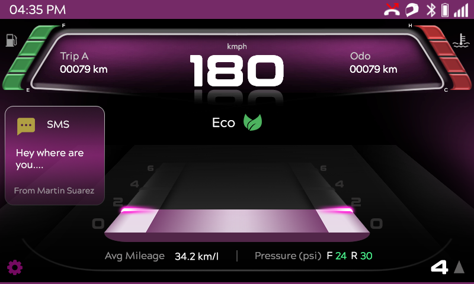

RH850 Digital Cluster Demo (800×480)
-----------------------------------------
Version: 1.0
------------

This project contains a Digital Cluster demo designed to run on the Renesas RH850 platform using the Flint UI Designer tool.
It includes UI assets, project files, firmware output, and documentation to help developers quickly evaluate Sparklet.

Follow these steps to set up and run the demo.

**1. Requirements**

Software

- Flint UI Designer (latest version)

**2. Importing the Project into Flint**

- Open Flint IDE
- Click File → Import Project
- Select Existing Projects into Workspace
- Click Next
- Select the folder and click finish.

**3. Explore the UI**

Inside Flint:

- Open Screen Layouts.
- Click screens like Home, Menu, Navigation etc.
- Review widgets (images, buttons,effects, animations etc.)
- Adjust properties using the Properties Panel.

**4. Build the Project**

- Click on Export All
- Flint generates: .bin, .h ,these files contain the render logic for your embedded project.
- Import them into your embedded IDE.

The following screenshot shows the main UI of the cluster demo:

Useful Links
-----------

- Sparklet UI : https://sparkletui.com
- Flint UI Designer Documentation : https://sparkletui.com/flint-ui-designer
- Sparklet Documentation : https://sparkletui.com/documentation/sparklet-gui-library/

Support/Issues
--------------

- For issues or support related to this demo, please submit your request via our contact form at: https://sparkletui.com/contact-us or email us at: sales@sparkletui.com
